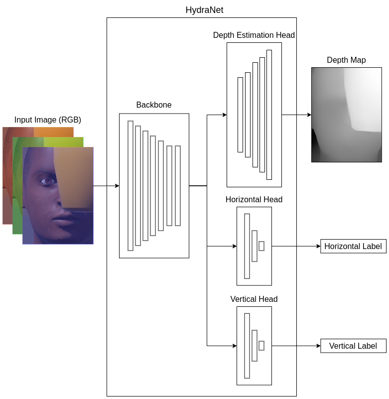

# HydraNet (Multi-Task Learning) Training

## Overview
This folder contains the complete codebase for generating labels through four distinct labeling methods applied to data gathered from the Webots simulation environment. It also includes a comprehensive framework for training a direction decision neural network. Below is the architecture of the HydraNet network, an advanced multi-task learning model, which simultaneously performs three distinct tasks. Equipped with two separate heads, it determines the optimal direction towards which the drone should move to achieve a better face verification score and thereby obtain a less occluded view. The two heads decide the best movement direction on the horizontal and vertical axes, respectively. These axes are separated, allowing the drone to independently choose the optimal direction on each axis. The third head carries out the auxiliary task of depth estimation. This is done so that the backbone network is forced to learn a representation that includes depth information, thereby aiding the direction decision heads to perform better by identifying which parts of the image are closer (likely the occluding object) and which are farther away (likely the human face).

    
    <figcaption></figcaption>

Below is a brief overview of the contents included in this folder.

### Contents of this Folder

1. **`data/`**
    - **Description**: The folder containing the scripts `dataset_utils.py` and `dataset.py` is a pivotal component of the project, primarily focused on data preprocessing for the deep learning training. The `dataset_utils.py` script is integral for executing various data handling tasks, including augmentation, normalization, transformation, and labeling, ensuring that the data is optimally formatted and primed for model training. Meanwhile, `dataset.py` establishes a custom dataset structure, potentially extending PyTorch's Dataset class, to facilitate efficient data loading and batching.

2. **`evaluation_results/`**
    - **Description**: In this folder, you will find the results of the simulation evaluation process conducted in Webots. Specifically, it contains a series of CSV files, each corresponding to one of the labeling methods used in the project. Each file comprises 500 examples where a drone, operating within the simulation environment, follows the guidance of the selected model for 10 steps. These CSV files meticulously record the verification scores at each step, offering a comprehensive evaluation dataset. This collection is invaluable for assessing how effectively the model enhances the face verification task, providing clear insights into its performance and accuracy in a simulated setting.

3. **`notebooks/`**
    - **Description**: This folder is a comprehensive collection of Jupyter notebooks, each serving a distinct purpose in the broader scope of a deep learning project. The notebooks include:
    
    1. `grid_datasets_sanity_check.ipynb`: A notebook dedicated to performing sanity checks on the datasets, ensuring data integrity and correctness.

    2. `evaluation.ipynb`: Concentrates on assessing the models performance based on the simulation data, which are recorded in CSV files (`evaluation_results/`).

    3. `train_test_datasets.ipynb`: Utilized for preparing and inspecting the training and testing datasets, ensuring they are correctly split and representative.

    4. `jetlitter_augmentation_values.ipynb`: Involves experimenting with and determining optimal data augmentation values for the JetLitter augmentation method.

    5. `raw_dataset_statistics.ipynb`: Provides statistical analysis of the raw dataset, crucial for understanding the data distribution and characteristics.

    6. `optimal_input_dimensions.ipynb`: Aims at finding the optimal input dimensions for the model, balancing between computational efficiency and model performance.

    7. `estimate_depth.ipynb`: Focuses on calculating depth values, a key step in the pre-processing phase. This process not only prepares the data but also aids in training the model's depth estimation head effectively.

4. **`saved_models/`**
    - **Description**: This contains houses the stored models from each experiment conducted using the `train.py` file. Specifically, it includes the weights of the best-performing model from each experiment, saved as a PTH file. Additionally, the configuration file used for each experiment is also saved as a YAML file, bearing the same name as the corresponding model's weights.
    
5. **`config.yaml`**
   - **Description**: The config.yaml file is an essential configuration document in a machine learning project, serving as a centralized repository for various adjustable parameters and settings. This YAML (YAML Ain't Markup Language) file typically contains key configurations such as model hyperparameters, training settings, data preprocessing guidelines, and environment variables. Its structured format allows for easy readability and modification, enabling developers to conveniently alter the behavior of the machine learning model and training process without delving into the core codebase. By adjusting the values in this file, one can experiment with different settings to optimize model performance, streamline data processing, and tailor the training environment to specific requirements, making it a versatile and critical tool in the machine learning workflow.

6. **`model.py`**
   - **Description**: The model.py script is responsible for defining the HydraNet architecture in PyTorch. The effectiveness and efficiency of the deep learning model largely hinge on the design and complexity outlined in this script, making it a cornerstone of the project.

7. **`train_utils.py`**
   - **Description**: This script acts as a backbone for the training operation, providing reusable components that streamline tasks like gradient computation, learning rate scheduling, and model evaluation. By abstracting these functionalities into a separate module, `train_utils.py` not only enhances the organization and readability of the training code but also promotes code reusability and modularity, making the training process more manageable and efficient.

8. **`train.py`**
   - **Description**: This script is designed to manage the model's training process. It takes charge of initializing the model, handling and preprocessing the dataset, and executing the training loop, which includes calculating the loss and updating the model's weights. A standout feature of this script is its integration with Weights & Biases, a platform that tracks and visualizes the training process, making it easier to monitor performance metrics and compare different experiments. Additionally, the script saves the weights of the best-performing models, facilitating their use in subsequent analyses or practical applications.

