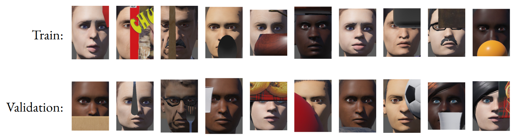
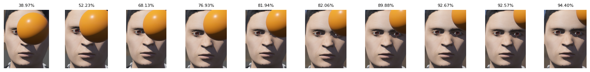
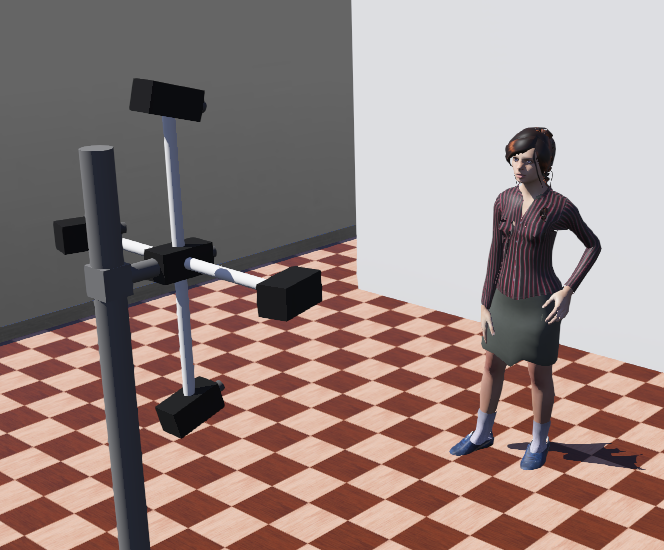
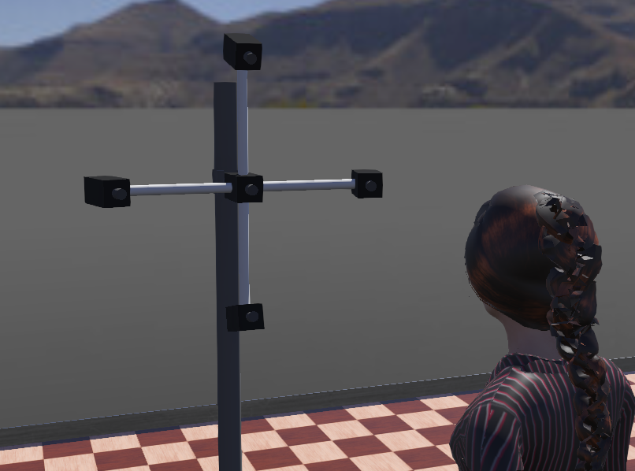
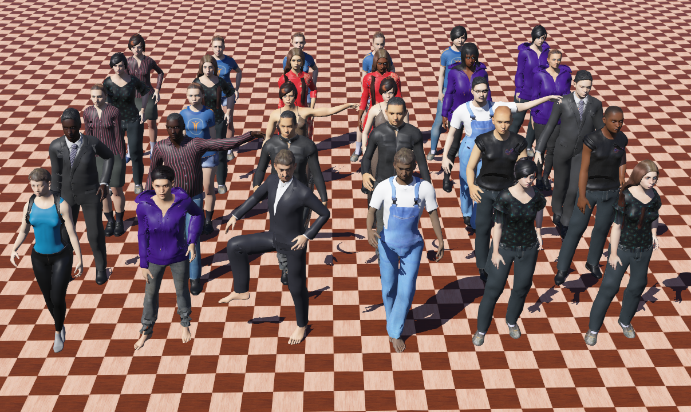
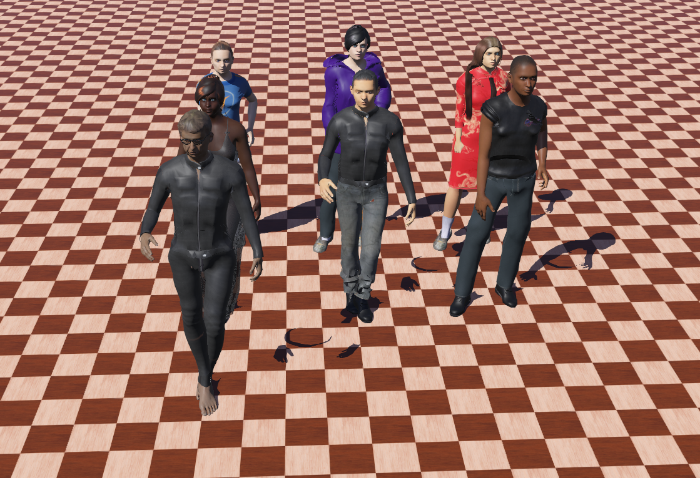
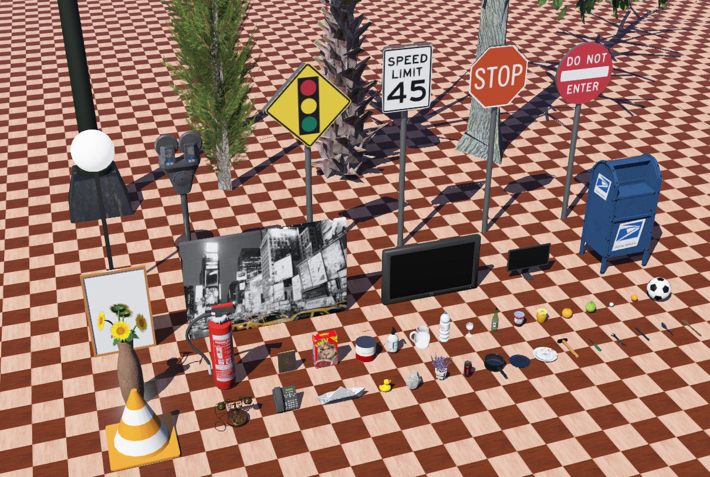
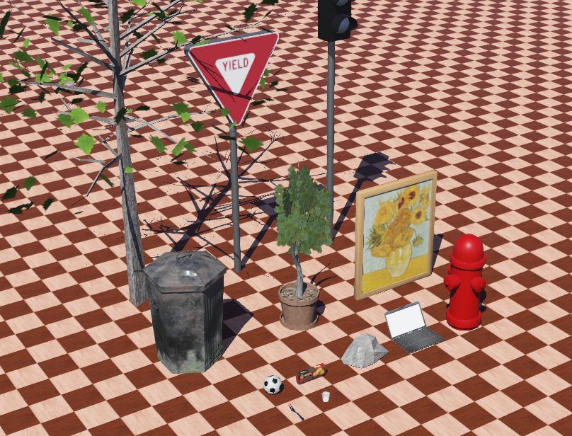
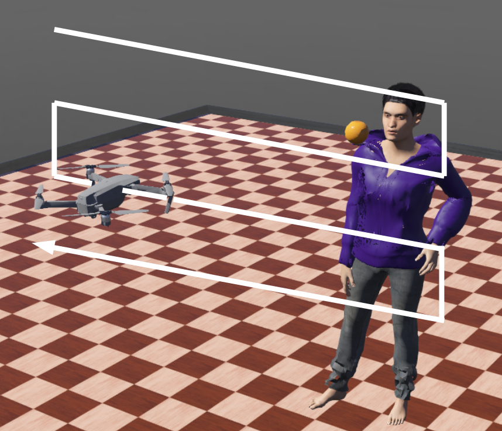

# Webots Simulation Files for Active Perception

This collection of files is designed to work with the Webots simulation software, providing functionalities for tasks like face database creation, grid-based data collection, and model evaluation in simulated environments. Additionally, corresponding Webots world files and protos are included to set up the simulation environments.

## Primary Tasks

These files are crafted to perform three primary tasks supporting the active perception task for face recognition:

1. **Face Database Creation**:
   - Controller: `controller_collect_faces_for_database.py`
   - World: `Create_Faces_database.wbt`
   - Purpose: This script is dedicated to automating the creation of a comprehensive face database. It does so by systematically spawning different human models within the simulation environment and capturing their faces from various perspectives including central-frontal, left, right, below, and above. This multifaceted approach in capturing images ensures the development of a robust face recognition system capable of accurately identifying faces across diverse angles and conditions. The resultant database serves as a foundational element in enhancing the efficacy of face recognition tasks, providing a rich dataset for training and testing face recognition algorithms.
    

2. **Active Perception Dataset Collection**:
   - Controller: `controller_mavic2pro_grid_data_collection.py`
   - World: `Occlusion_Removal.wbt`
   - Purpose: The purpose of this controller is to gather a dataset specifically tailored for active perception research. The process involves piloting a Mavic 2 Pro drone through a pre-defined grid in front of human subjects whose faces are partially occluded. Each iteration of this process spawns a new human-object pair, guiding the drone across a 20x20 grid to collect up to 400 unique samples. At each point in the grid, the script captures an image and evaluates face recognition accuracy, focusing particularly on how occlusion impacts recognition. This dataset is invaluable in researching and developing algorithms capable of dealing with occlusions in face recognition, thus enhancing the robustness of these systems in real-world scenarios.

    

        
        <figcaption>Video from the Webots simulation environment showing the data collection process</figcaption>
    

     

3. **Active Perception Model Evaluation**:
   - Controller: `controller_mavic2pro_evaluation.py`
   - World: `Occlusion_Removal.wbt`
   - Purpose: This script is focused on evaluating the performance of a trained active perception model within a simulated setting. In each iteration of the simulation, a randomly selected pair of a human and an occluding object is introduced. The drone, guided by the trained model, undertakes tasks to either clear the occlusion from the human's face or navigate around it. After completing all iterations, the script compiles a CSV file with recognition scores for each step in each iteration. This compiled data is vital for analyzing the model's decision-making effectiveness in various simulation scenarios. It provides crucial insights for refining and optimizing the model, particularly in how it navigates and resolves occlusions in the context of face recognition tasks.

        

            

                
                <figcaption>Video showing the evaluation of a trained network on an Over-the-Shoulder scenario</figcaption>
            

            

                
                <figcaption>Video showing the evaluation of a trained network on an Urban scenario</figcaption>
            
    
        

     

## Files Overview

1. **`controllers/`**:
    - **`controller_collect_faces_for_database/`**:
        - **`controller_collect_faces_for_database.py`**: This script is designed to automate the creation of a face database within a Webots simulation environment. It systematically spawns different human models and captures their facial images from multiple angles.
    - **`controller_mavic2pro_grid_data_collection/`**:
        - **`controller_mavic2pro_grid_data_collection.py`**: this script is designed for grid-based data collection within a Webots simulation environment, utilizing the Mavic 2 Pro drone. It orchestrates the drone's movement across a predefined grid in front of a human subject, whose face is partially occluded. At each grid point, the script captures an image and records the face recognition accuracy, focusing on the impact of occlusion on recognition. This process is repeated for various human-object pairings, generating a dataset that is crucial for studying and improving algorithms that handle occlusions in face recognition.

            

                
                <em>Sample images for both the train and test sets produced with this controller.</em> 
            

    - **`controller_mavic2pro_evaluation/`**:
        - **`controller_mavic2pro_evaluation.py`**: This script is tailored for evaluating active perception models in a Webots simulation using the Mavic 2 Pro drone. In each iteration, it spawns random pairs of humans and objects, then guides the drone based on the trained model's directives to perform tasks like navigating around occlusions or clearing obstructions from the human's face. The script captures and records the face recognition accuracy at each step, aggregating this data into a CSV file upon completion.

            

                
                <em>Example of how the drone's view is enhanced when navigating around an occluded face, following the directions of the trained Hydranet.</em> 
            

    - **`spawn_utils.py`**: This script serves as a central repository for predefined catalogs. It contains structured data about various human models, and objects used in the simulation. Specifically, it includes characteristics such as dimensions, positions, orientations, and other properties essential for the spawning of the human-object pairs.
    - **`grid_utils.py`**: This script is designed for managing grid-based configurations. It defines the grid layout and associated parameters, like the dimensions, positions, and other characteristics of grid points, enabling systematic navigation and data capture by simulated entities like drones.
    - **`mavic2pro_actions.py`**: This script is dedicated to defining and executing actions for the Mavic 2 Pro drone within the Webots simulation environment. It includes methods for controlling the drone's movements, such as flying to specific coordinates, rotating, and adjusting altitude. Additionally, it contains capabilities for image capture and face recognition.
    - **`mavic2pro_behaviors.py`**: This script is designed to  manage two behavioral routines for the Mavic 2 Pro drone in the Webots simulation. This two behaviors are:
        1. **Grid-Based Perception**: This behavior involves navigating the drone across a predefined grid layout, typically in front of a subject or an object. At each grid point, the drone performs specific tasks, such as capturing images, conducting face recognition, or assessing environmental features. This systematic approach is crucial for collecting structured data or conducting detailed environmental analysis.
        2. **Active Perception for Occlusion Handling**: This behavior focuses on active perception strategies to handle occlusions. The drone autonomously adjusts its position and orientation to gain better visual access to subjects partially obscured by obstacles. This behavior is key in scenarios where clear visual information is critical, such as in face recognition tasks with occlusions or in complex environments requiring clear visual feedback for navigation or assessment.
    - **`spawn_controller.py`**: This script is integral to managing the spawning and positioning of human and object entities, within a Webots simulation. it includes functionalities to:
        - **Spawn Entities**: Dynamically place different human models and objects within the simulation environment, allowing for varied and controlled scenarios.
        - **Configure Positions and Orientations**: Precisely adjust the placement and angles of the spawned entities to meet specific simulation requirements or to create diverse situational setups.
        - **Support Various Simulation Modes**: It incorporates different modes like training, testing, or specific scenario recreations by customizing the types and arrangements of entities.
2. **`libraries/`**: This folder is empty for this project. Typically, this folder includes custom controllers in various programming languages, utility functions for common operations, third-party libraries for specialized functionalities, and hardware interface libraries for real-world interactions.

3. **`plugins/`**: This folder houses plugins for advanced functionalities not available in the standard Webots installation. These includes custom physics modules, robotic control algorithms, sensor and actuator extensions, and integration tools for external software and hardware. The folder is instrumental in customizing the simulation environment to meet specific project requirements.

4. **`protos/`**: In a Webots project, this folder is a specialized directory where custom prototype models, commonly referred to as "protos", are stored. In this specific project, this folder contains all the human entities used in the simulation, along with their appearance textures. Additionally, it includes the Mavic 2 Pro drone entity.

4. **`worlds/`**: This folder is a directory where all the virtual environment files, known as "worlds," are stored. Each world file defines a unique simulation environment with its own layout, entities, and physics properties. In this repository, this folder includes three distinct worlds:
    1. **`Create_Faces_Database.wbt`**: This world is specifically designed for automating the creation of a facial image database. It is configured to capture a set of five distinct facial views for each human prototype found in the provided `photos/` folder. These views include frontal, left, right, upward, and downward captures of each face. This comprehensive collection of varied facial images is crucial for achieving high accuracy in face recognition.

    

        
        
         
        <em>Pictures of the faces database generation for the world setup.</em> 
    

    2. **`Dataset_Promt.wbt`**: This world is designed not for conducting specific operations or simulations, but rather as a visual exhibition showcasing distinct prototypes used in generating training and testing datasets. This world does not require the use of a controller file, as its primary purpose is to display sets of human models and objects. Specifically, it presents two distinct groups of human models: one set representing the training dataset and another for the testing dataset. Similarly, objects are also displayed in two separate groups, corresponding to these datasets.

    

        
        
         
        <em>Human prots separated into the train and test sets.</em> 
    

    

        
        
         
        <em>Object prots separated into the train and test sets.</em> 
    

    3. **`Occlusion_Removal.wbt`**: is engineered to facilitate two distinct tasks, depending on the controller assigned to the Mavic 2 Pro drone.

        1. **Data Collection Task**: This task involves the drone systematically navigating through a 20x20 grid to perform data collection. In each iteration, a random human-object pair is spawned, and the drone moves through the grid to capture up to 400 images. This process focuses on collecting a comprehensive set of visual data, which is crucial for training the Hydranet to perform active perception for face recognition or occlusion handling.

            

                
                 
                <em>This image illustrates how the drone will maneuver in the hypothetical grid in front of the object-human pair to collect all 400 samples (20 x 20 grid).</em> 
            

        2. **Network Evaluation Task**: In this mode, the world is set up to evaluate the performance of a trained network. After spawning a human-object pair, the drone follows the directives of the trained HydraNet, moving accordingly. At each step, the drone records the face recognition accuracy, compiling this data into a CSV file. This file is instrumental in assessing the network's decision-making capabilities and overall effectiveness in navigating and resolving occlusions in the simulated environment.

    

## Prerequisites

- Webots: Ensure you have Webots 2023b installed.
- Python: Python 3.x is required.
- Additional Python Libraries: `numpy`, `opencv-python`, `torch`, `pandas`, `json`, `yaml`, `os`, `time`.

